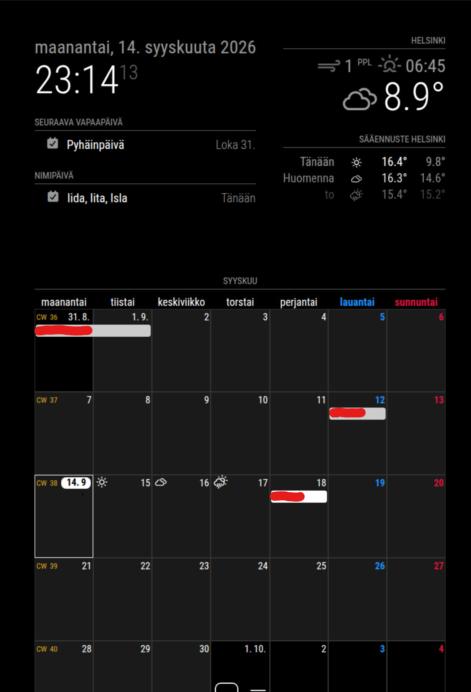

# MagicMirror² FMI Weather Provider

A weather provider for the built-in
[MagicMirror²](https://github.com/MagicMirrorOrg/MagicMirror) `weather` module
using open weather data from the
[Finnish Meteorological Institute (FMI)](https://en.ilmatieteenlaitos.fi/open-data).

The provider supplies current weather observations and daily forecasts without
requiring an API key.

## Screenshot



MagicMirror² weather module using FMI Open Data for current conditions and daily forecasts.

## Features

- Current weather observations from FMI
- HARMONIE weather forecasts from FMI
- Daily minimum and maximum temperatures
- Daily precipitation totals based on hourly forecast precipitation
- FMI weather symbols mapped to MagicMirror² Weather Icons
- Automatic day/night weather icon selection
- Sunrise and sunset calculation
- Finnish place-name queries
- No API key or FMI account required
- Standalone bundled provider for easy MagicMirror² installation

## Status

The provider is functional and has been tested with a real MagicMirror²
installation.

Tested environment:

- MagicMirror² 2.37.0
- Raspberry Pi 4
- Debian 11 Bullseye, arm64
- Node.js 24.x
- MagicMirror² built-in `weather` module

The project is currently pre-1.0 software. Configuration and installation
details may still change before the first stable release.

## Requirements

- MagicMirror² 2.37.0 or a compatible release
- Node.js:

```text
>=22.22.2 <23 || >=24
```

- Internet access to FMI Open Data services

The provider does not require an API key.

## Installation

Clone this repository on the system running MagicMirror²:

```bash
git clone https://github.com/i-xul/magicmirror-weather-fmi-provider.git
cd magicmirror-weather-fmi-provider
```

The repository contains a pre-built standalone provider:

```text
dist/fmi.js
```

Copy it into the built-in MagicMirror² weather provider directory:

```bash
cp dist/fmi.js ~/MagicMirror/defaultmodules/weather/providers/fmi.js
```

The resulting file should be:

```text
~/MagicMirror/defaultmodules/weather/providers/fmi.js
```

No `npm install` is required on the MagicMirror² system when using the bundled
`dist/fmi.js`.

Restart MagicMirror² after installing the provider.

For example, when using PM2:

```bash
pm2 restart mm2
```

## Configuration

The provider requires:

- `location`
- `lat`
- `lon`
- `timezone`

`location` is used for FMI weather queries.

`lat` and `lon` are used for solar calculations such as sunrise, sunset and
day/night weather icon selection.

`timezone` must be a valid IANA time zone identifier, for example:

```text
Europe/Helsinki
```

### Current weather

Example MagicMirror² configuration:

```javascript
{
    module: "weather",
    position: "top_right",
    config: {
        weatherProvider: "fmi",
        type: "current",
        location: "Helsinki",
        lat: 60.1699,
        lon: 24.9384,
        timezone: "Europe/Helsinki",
        showFeelsLike: false
    }
},
```

### Daily forecast

```javascript
{
    module: "weather",
    position: "top_right",
    config: {
        weatherProvider: "fmi",
        type: "forecast",
        location: "Helsinki",
        lat: 60.1699,
        lon: 24.9384,
        timezone: "Europe/Helsinki",
        maxNumberOfDays: 5,
        ignoreToday: false
    }
},
```

Both weather modules can be used at the same time.

## Provider-specific configuration

| Option | Required | Description |
| --- | --- | --- |
| `weatherProvider` | Yes | Must be `"fmi"` |
| `type` | Yes | `"current"` or `"forecast"` |
| `location` | Yes | Place name used for FMI queries |
| `lat` | Yes | Latitude used for solar calculations |
| `lon` | Yes | Longitude used for solar calculations |
| `timezone` | Yes | IANA time zone, e.g. `"Europe/Helsinki"` |
| `maxNumberOfDays` | No | Maximum number of forecast days |
| `updateInterval` | No | Provider update interval in milliseconds |
| `initialLoadDelay` | No | Delay before the first request in milliseconds |

The default provider update interval is 10 minutes.

An invalid or unsupported configuration is reported through the MagicMirror²
weather provider error handling.

## Supported weather types

The provider currently supports:

```text
current
forecast
```

MagicMirror² `hourly` weather mode is not currently supported.

## FMI weather data

The provider uses the Finnish Meteorological Institute Open Data WFS service.

Current observations use FMI surface weather observations.

Forecasts use FMI HARMONIE forecast data.

The provider requests and transforms FMI data into the format expected by the
built-in MagicMirror² `weather` module.

Forecast data currently includes information such as:

- temperature
- humidity
- wind direction
- wind speed
- hourly precipitation
- cloud cover
- visibility
- wind gusts
- pressure
- dew point
- FMI weather symbol

Observation and forecast data availability depends on FMI services and the
selected location.

## Weather symbols

FMI `WeatherSymbol3` values are converted to MagicMirror² Weather Icon names.

Supported conditions include:

- clear
- partly cloudy
- cloudy
- rain showers
- rain
- snow showers
- snowfall
- thunderstorms

Day and night variants are selected automatically where supported.

## Sunrise and sunset

Sunrise, sunset and daylight state are calculated locally from:

- latitude
- longitude
- observation timestamp

This also allows the provider to handle locations and dates where normal
sunrise or sunset events do not occur, such as polar day and polar night.

## Updating

Update the repository:

```bash
cd ~/magicmirror-weather-fmi-provider
git pull --ff-only
```

Then copy the newly built distribution file to MagicMirror² again:

```bash
cp dist/fmi.js ~/MagicMirror/defaultmodules/weather/providers/fmi.js
```

Restart MagicMirror²:

```bash
pm2 restart mm2
```

If MagicMirror² itself is updated, verify that the custom provider file still
exists:

```bash
ls -l ~/MagicMirror/defaultmodules/weather/providers/fmi.js
```

The current installation method places the provider inside the MagicMirror²
core `defaultmodules/weather/providers/` directory, so it is a good idea to
verify the file after MagicMirror² upgrades.

## Uninstallation

Remove the provider file:

```bash
rm ~/MagicMirror/defaultmodules/weather/providers/fmi.js
```

Then remove or change the corresponding FMI weather configuration blocks in:

```text
~/MagicMirror/config/config.js
```

Restart MagicMirror² afterwards.

## Development

Clone the repository and install dependencies:

```bash
git clone https://github.com/i-xul/magicmirror-weather-fmi-provider.git
cd magicmirror-weather-fmi-provider
npm install
```

Run the deterministic test suite:

```bash
npm test
```

Build the standalone MagicMirror² provider:

```bash
npm run build
```

Run the bundle smoke test:

```bash
npm run test:bundle
```

Run the normal project validation:

```bash
npm run check
```

The validation command runs the deterministic tests, rebuilds the distribution
bundle and verifies that the generated CommonJS provider can be loaded in the
form expected by MagicMirror².

### Live FMI integration tests

Live integration tests are available separately:

```bash
npm run test:live
```

These tests contact the real FMI Open Data service and therefore require
Internet access.

They are intentionally separate from the deterministic test suite because live
external services may occasionally be unavailable or return changing data.

## Project structure

```text
dist/
    fmi.js                  Standalone MagicMirror² provider bundle

scripts/
    build-dist.mjs          Distribution bundle build script

src/
    fmi-client.js           FMI WFS request handling
    fmi-parser.js           FMI XML time-series parser
    fmi-service.js          FMI observation and forecast service
    fmi-weather.js          FMI data normalization
    magicmirror-current.js  Current weather transformation
    magicmirror-forecast.js Daily forecast transformation
    magicmirror-provider.js MagicMirror² provider lifecycle
    magicmirror-service.js  High-level MagicMirror² weather service
    magicmirror-weather.js  FMI weather symbol mapping
    solar.js                Solar calculations
    timezone.js             Time zone helpers

test/
    fixtures/               Deterministic FMI XML fixtures
```

## Weather data and attribution

Weather observations and forecasts are provided by the Finnish Meteorological
Institute (FMI) Open Data service.

FMI Open Data is licensed under the
[Creative Commons Attribution 4.0 International License](https://creativecommons.org/licenses/by/4.0/).

Data source:

**Finnish Meteorological Institute**

More information:

- https://en.ilmatieteenlaitos.fi/open-data
- https://en.ilmatieteenlaitos.fi/site-information

This repository contains FMI-derived test fixtures for development and testing.
Their weather data remains subject to the applicable FMI Open Data licence and
attribution requirements.

## License

The software in this repository is licensed under the MIT License.

See [LICENSE](LICENSE).

FMI weather data is not covered by the repository's MIT License. FMI data is
provided under its own Open Data licensing terms as described above.

## Author

H A ([i-xul](https://github.com/i-xul))
